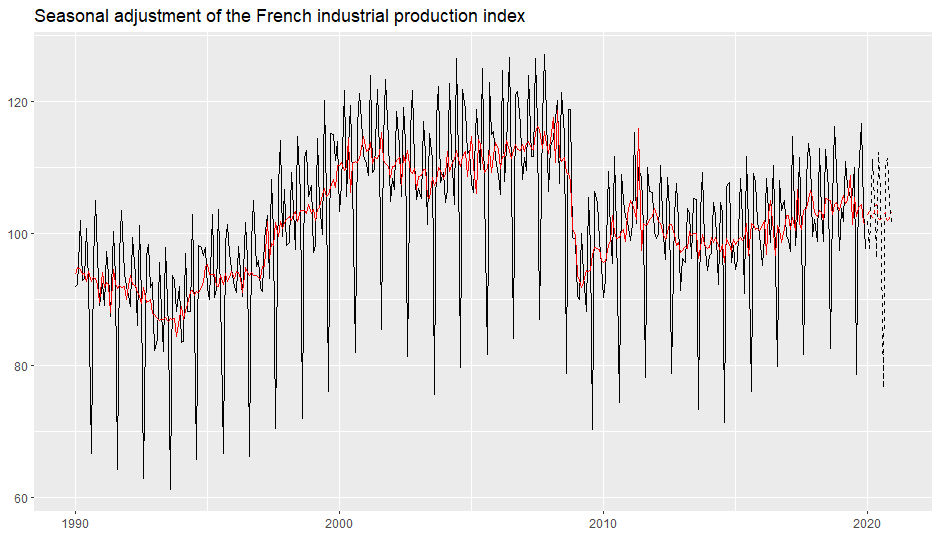
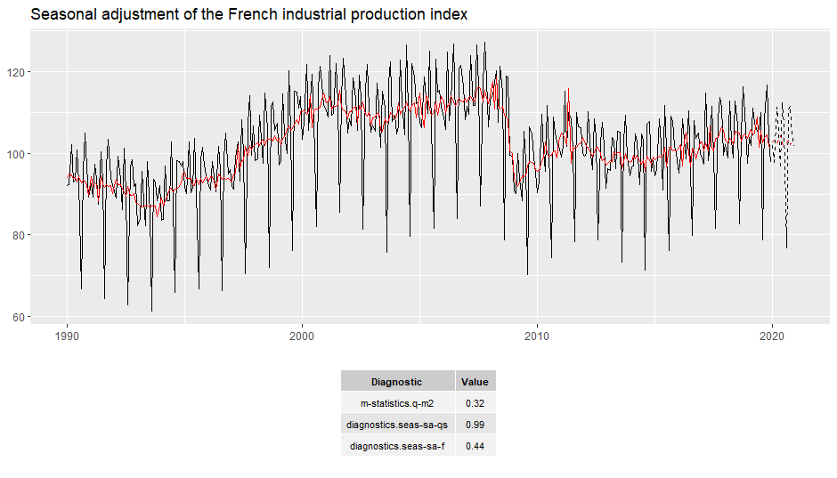
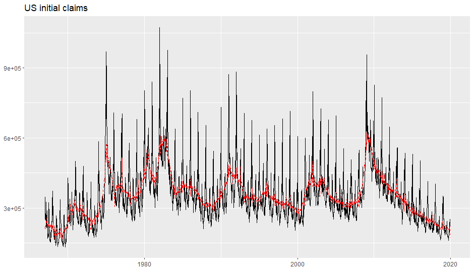

<!-- README.md is generated from README.Rmd. Please edit that file -->

# ggdemetra3 

[](https://github.com/AQLT/ggdemetra3/actions)
<!-- [](https://cran.r-project.org/package=ggdemetra3) -->
<!-- [](https://cran.r-project.org/package=ggdemetra3) -->
<!-- [](https://cran.r-project.org/package=ggdemetra3) -->
<!-- [](https://cran.r-project.org/package=ggdemetra3) -->

## Overview

ggdemetra3 is an extension of
[ggplot2](https://github.com/tidyverse/ggplot2) to add seasonal
adjustment statistics to your plots. The seasonal adjustment process is
done with [rjdemetra3](https://github.com/palatej/rjdemetra3) that is an
R interface to [JDemetra+](https://github.com/jdemetra/jdemetra-app),
the seasonal adjustment software [officially
recommended](https://ec.europa.eu/eurostat/cros/system/files/Jdemetra_%20release.pdf)
to the members of the European Statistical System (ESS) and the European
System of Central Banks. rjdemetra3 implements the two leading seasonal
adjustment methods
[TRAMO/SEATS+](http://gretl.sourceforge.net/tramo/tramo-seats.html) and
[X-12ARIMA/X-13ARIMA-SEATS](https://www.census.gov/data/software/x13as.html).

There are 4 main functionnalities in `ggdemetra3` depending of what you
want to add in the graphic:

- `geom_sa()`: to add a time series compute during the seasonal
  adjustment (the trend, the seasonal adjusted time series, etc.).  
- `geom_outlier()`: to add the outliers used in the pre-adjustment
  process of the seasonal adjustment.
- `geom_arima()`: to add the ARIMA model used in the pre-adjustment
  process of the seasonal adjustment.
- `geom_diagnostics()`: to add a table containing some diagnostics on
  the seasonal adjustment process.

## Installation

Since rjdemetra3 requires Java SE 17 or later version, the same
requirements are also needed for ggdemetra3.

``` r
# Install development version from GitHub
# install.packages("remotes")
# Install dependencies
remotes::install_github("palatej/rjd3toolkit")
remotes::install_github("palatej/rjd3modelling")
remotes::install_github("palatej/rjd3sa")
remotes::install_github("palatej/rjd3arima")
remotes::install_github("palatej/rjd3x13")
remotes::install_github("palatej/rjd3tramoseats")
remotes::install_github("palatej/rjdemetra3")
remotes::install_github("palatej/rjd3sts")
remotes::install_github("palatej/rjd3highfreq")
# install ggdemetra3
remotes::install_github("AQLT/ggdemetra3")
```

If you have troubles with the installation of ggdemetra3, check the
[installation
manual](https://github.com/jdemetra/rjdemetra/wiki/Installation-manual).

## Usage

By default, the seasonal adjustment is made with X-13-ARIMA with the
pre-defined specification “RSA5c” (automatic log detection, automatic
ARIMA and outliers detection and trading day and easter adjustment). If
no new data or seasonal adjustment specification is specified (method or
specification), these parameters is inherited from the previous defined:
therefore you only need to specify the specification once. In the
following examples, the seasonal adjustment will be perform with
X-13-ARIMA with working day adjustment and no gradual easter effect
adjustment (it is the specification that has the most economic sense for
the industrial production index).

To add the seasonal adjusted series and the forecasts of the input data
and of the seasonal adjusted series:

``` r
library(ggdemetra3)
spec <- rjd3x13::spec_x13_default("rsa3")
spec <- rjd3modelling::set_tradingdays(spec, option = "WorkingDays")
p_ipi_fr <- ggplot(data = ipi_c_eu_df, mapping = aes(x = date, y = FR)) +
    geom_line() +
    labs(title = "Seasonal adjustment of the French industrial production index",
         x = NULL, y = NULL)
p_sa <- p_ipi_fr +
    geom_sa(component = "y_f(12)", linetype = 2,
            spec = spec) + 
    geom_sa(component = "sa", color = "red") +
    geom_sa(component = "sa_f", color = "red", linetype = 2)
p_sa
```



To add the outliers at the bottom of the plot with an arrow to the data
point and the estimated coefficients:

``` r
p_sa + 
    geom_outlier(geom = "label_repel",
                 coefficients = TRUE,
                 ylim = c(NA, 65), force = 10,
                 arrow = arrow(length = unit(0.03, "npc"),
                               type = "closed", ends = "last"),
                 digits = 2)
```


To add the ARIMA model:

``` r
p_sa + 
    geom_arima(geom = "label",
               x_arima = -Inf, y_arima = -Inf, 
               vjust = -1, hjust = -0.1)
```


To add a table of diagnostics below the plot:

``` r
diagnostics <- c(`Q-M2` = "m-statistics.q-m2",
                 `Residual qs-test (p-value)` = "diagnostics.seas-sa-qs",
                 `Residual f-test (p-value)` = "diagnostics.seas-sa-f")
p_diag <- ggplot(data = ipi_c_eu_df, mapping = aes(x = date, y = FR)) +
    geom_diagnostics(diagnostics = diagnostics,
                     table_theme = gridExtra::ttheme_default(base_size = 8),
                     message = FALSE) + 
    theme_void()
    
gridExtra::grid.arrange(p_sa, p_diag,
             nrow = 2, heights  = c(4, 1.5))
```



See the
[vignette](https://aqlt.github.io/ggdemetra3/articles/ggdemetra3.html)
for more details.

Note that `ts` objects cannot be directly used in `ggplot2`. To convert
`ts` or `mts` object to `data.frame`, you can use the `ts2df()`
function.

``` r
ipi_c_eu_df <- ts2df(ipi_c_eu)
```

## High-frequency seasonal adjustment

The `geom_sa()` function is also compatible with some methods that can
be used for high-frequency seasonal adjustment (`"x11-extended"`,
`"fractionalairline"`, `"multiairline"` or `"stl"`)

``` r
p_us_init_claims<- ggplot(data = usclaims, mapping = aes(x = date, y = `Initial claims`)) +
    geom_line() +
    labs(title = "US initial claims",
         x = NULL, y = NULL)
p_sa <- p_us_init_claims +
    geom_sa(component = "sa", linetype = 2,frequency = 52,
            method ="multiairline",
            col = "red") 
p_sa
```



## autoplot()

`ggdemetra3` also provides `autoplot()` functions to plot seasonal
adjustment models:

``` r
mod <- rjd3x13::x13(ipi_c_eu[,"FR"])
autoplot(mod)
```


The different components of seasonal adjustment models can also be
extracted through `calendar()`, `calendaradj()`, `irregular()`,
`trendcycle()`, `seasonal()`, `seasonaladj()`, `trendcycle()` and
`raw()`:

``` r
monthplot(seasonal(mod))
```


The SI ratio can also be plotted with `siratioplot()` and
`ggsiratioplot()` functions :

``` r
siratioplot(mod)
```


